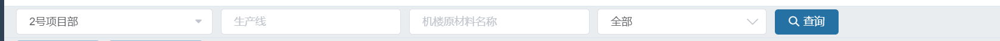
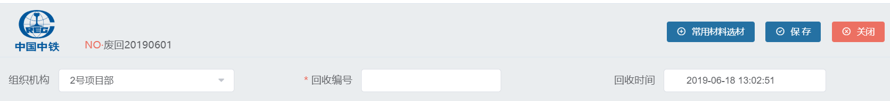
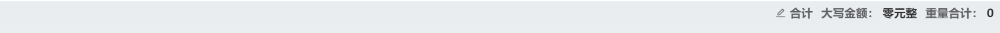
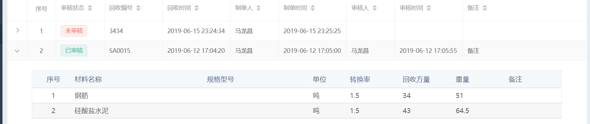
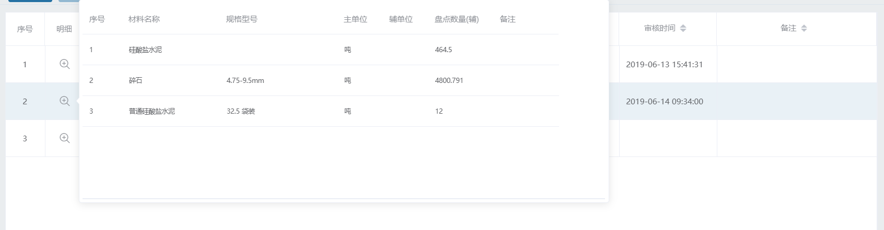
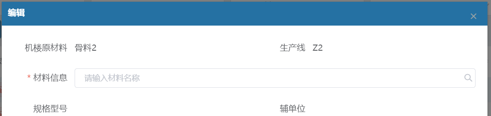
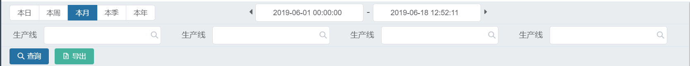

# 开发规范

[[toc]]

### 彩色
:::tip
   color 使用规定
  :::
primary, // 主色

success, // 成功色

info, // 提示色

warning, // 警告色

danger, // 危险色

fontPrimary,

fontSecond,

fontHelper,

border,

borderDark,

theme, // 主题色

background
1. 纯色使用：color:$theme

2. 混合色渐变使用：background-color:mixc($primary,#fff,0.8)

### 图标
  :::tip
    功能图标规定(超出使用规定的功能图标大小要保持一致)
  :::
1. <el-button size="small" type="primary" icon="el-icon-add">添加</el-button>  `<el-button size="small" type="primary" icon="el-icon-add">添加</el-button>`

2. <el-button size="small" type="primary" icon="el-icon-edit">修改</el-button>  `<el-button size="small" type="primary" icon="el-icon-edit">修改</el-button>`

3. <el-button size="small" type="danger" icon="el-icon-delete">删除</el-button>  `<el-button size="small" type="danger" icon="el-icon-delete">删除</el-button>`

4. <el-button size="small" type="primary" icon="el-icon-user">审核</el-button>  `<el-button size="small" type="primary" icon="el-icon-user">审核</el-button>`

5. <el-button size="small" type="primary" icon="el-icon-user">撤销审核</el-button>  `<el-button size="small" type="primary" icon="el-icon-user">撤销审核</el-button>`

6. <el-button size="small" type="primary" icon=""><i class="el-icon-team"></i>审批</el-button>  `<el-button size="small" type="primary"><i class="el-icon-team"></i>审批</el-button>`

7. <el-button size="small" type="primary" icon="el-icon-team">撤销审批</el-button>  `<el-button size="small" type="primary" icon="el-icon-team">撤销审批</el-button>`

8. <el-button size="small" type="primary" icon="el-icon-search">查询</el-button>  `<el-button size="small" type="primary" icon="el-icon-search">查询</el-button>`

9. <el-button size="small" type="primary" icon="el-icon-remove-outline">选材</el-button>  `<el-button size="small" type="primary" icon="el-icon-remove-outline">选材</el-button>`

10. <el-button size="small" type="primary" icon="el-icon-circle-check-outline">保存</el-button>  `<el-button size="small" type="primary" icon="el-icon-circle-check-outline">保存</el-button>`

11. <el-button size="small" type="danger" icon="el-icon-circle-close-outline">关闭</el-button>  `<el-button size="small" type="danger" icon="el-icon-circle-close-outline">关闭</el-button>`

12. <el-button size="small" type="danger" icon="el-icon-refresh">重置</el-button>  `<el-button size="small" type="danger" icon="el-icon-refresh">重置</el-button> `

13. <el-button icon="el-icon-i-back" round size="small">返回</el-button>  `<el-button icon="el-icon-i-back" round size="small">返回</el-button>`

14. <el-button icon="el-icon-zoom-in" circle size="small"></el-button>  `明细查看<el-button icon="el-icon-zoom-in" circle size="small"></el-button>`

15. <el-button size="small" type="success"  icon="el-icon-file-excel">导出</el-button>  `<el-button size="small" type="success"  icon="el-icon-file-excel">导出</el-button>`

16. <el-button size="small" type="primary"  icon="el-icon-printer">打印</el-button>  `<el-button size="small" type="primary"  icon="el-icon-printer">打印</el-button>`

备注：报表中渲染需用图标，请使用Iconfont-阿里巴巴矢量图标库 。
     地址 https://www.iconfont.cn/，登陆成功后在图标管理中找到我的项目，如项目中没有自己使用的图标请在大库中搜索选取适合自己的图标添加至我的项目中，然后点击下载至本地，用下载到的包替换web-content/components/font文件即可（注意：添加图标请按需添加，不要造成垃圾图标）

### 布局
 :::tip
    模块页面过滤器
  :::
   

   1. 过滤条件每行最多显示5个, 大小统一使用(size="small" style="width:100%")

   2. 模块中查询按钮统计跟在最后一个过滤器后面
  
  :::tip
    主从表编辑页面
  :::
  
  

  1. 根据实际业务需求，显示返回按钮。如只显示一个标题请居左

  2. 根据实际业务需求，可显示log图标（居左）、单号信息（log左下角），显示botton按钮居右：如 选材、保存、关闭等按钮

  3. 编辑页面编辑主表信息请使用el-form组建, 采用24栏布局一行最多显示4个

  4. 根据业务需求，判断重复时，提示信息请严格规范

  5. 当某筛选条件大于2时请使用select下拉控件，否则使用checkbox控件,input 需要检索查询时input 框带放大镜，否则不需要显示

  6. 使用控件yl-tableedit时需注意,如有金额计算请显示sumRowConf合计（默认为开启），否则请彻底关闭合计行
 
  :::tip
    主从表查看详情页面
  :::
 

 

  1. 明细信息量大时，请使用el-dialog弹框 大小90%

  2. 明细信息量小、显示列信息多时，请使用 @expand-change="_rowExpand" 折叠方式.（具体使用请参考：混凝土废料回收模块）

  3. 明细信息量小、显示列信息少时，请使用 Popover 弹出框（具体使用请参考：原材料盘点模块）
  
  :::tip
    单表编辑页面
  :::
   

   1. 使用el-dialog控件，width="550px" (一列布局) 、width="800px" (两列布局)、大于二列布局时width="80%"

   2. 遵循重要编辑信息往前放原则

   3. 根据业务需求，判断重复时，提示信息请严格规范

   4. 按需使用 保存后关闭、重置、保存 按钮 ，图标按规定使用，大小为size="small"

  :::tip
   报表页面过滤器
  :::
  

  1. timebar时间空间为单独一行显示（本日、本周、本月、本季、本年）
  
  2. 第一个yl-toolbar中，以el-form组件配置其他过滤条件,采用24栏布局，每行最多显示4个, 大小统一使用(size="small" style="width:100%") 。第二个yl-toolbar中，放查询按钮、导出按钮大小为small

  3. 当某筛选条件大于2时请使用select下拉控件，否则使用checkbox控件,input 需要检索查询时input 框带放大镜，否则不需要显示
  

备注：web端开发请严格遵循开发规范，保持风格统一性。